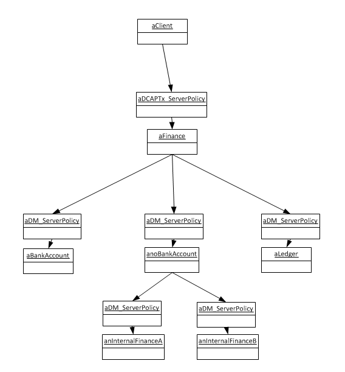
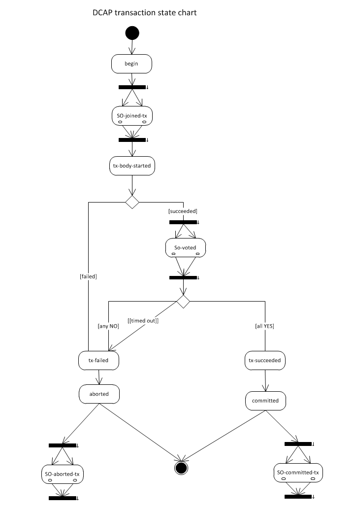
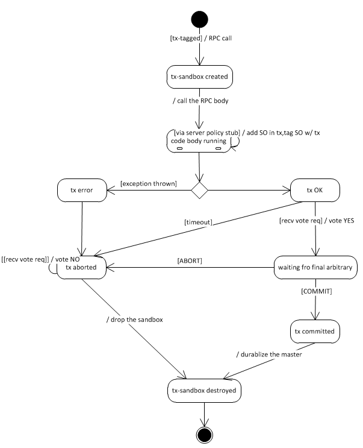

# Use Case
## Ideal User Experience
The `transferMoney` method in the following class is annotated with `@Trasaction` which means that operations within the method
should be executed as one transaction, either all succeed or all fail. Operations in `transferMoney` method, e.g. `account1.debit` or 
`account2.credit` or `ledger.log` are remote service calls.

```
public class Finance {   
    Ledger book;
    ...
    @Transaction
    public boolean transferMoney(BankAccountFoo account1, AccountBar account2, unsigned int amount) {
       account1.debit(amount);
       account2.credit(amount);
       this.book.log(String.Format("transferred from %s to %s amount %d", account1.name(), account2.name(), amount)); 
       return true;
    }
}
```

Transactional code is written as below:
```
Finance finance;
BankAccountFoo account1;
BankAccountBar account2;
...
try{
  ...
  boolean success = finance.transferMoney(account1, account2, 100);
  ...
} catch (TransactionException te) {
  ...
}
```
### Options
* We may constraint (transaction-annotated) Transactional method declared as static to express the scope of resources involved in the transaction for the first phase, for the sake of simpilicty.
* We may consider other forms of failure notification than the exception.   

## Phase 1 - Collaborative 2PC Distributed Transaction
* P1: Default distributed transaction (SO/DM not comoplicated)
* P1: External database (type: TO-BE-DECIDED)
* P2: support participant of SO that has consensus DM
* P2: participant crash-recovery repair support
### Assumptions of Phase 1
<br/>All participants of the transaction have to have 2PC-compiliant transaction DM.
<br/>Sapphire objects MUST not be involved in multiple threading executions inside of transaction (thiis one limitation of phase 1. We may allow SO to work multi-threading when threads are started under the control of DM in the future.)   
<br/>Concurrent control policy is lock-based perssimitive. 
### User Experience
Code to define transaction
```
class FinanceTxn implements Sapphire<DCAPTranaction> {
    Ledger book;
    ...
    public boolean transferMoney(BankAccountFoo account1, AccountBar account2, unsigned int amount) {
       account1.debit(amount);
       account2.credit(amount);
       this.book.log(String.Format("transferred from %s to %s amount %d", account1.name(), account2.name(), amount)); 
       return true;
    }
}
```
Code to invoke transaction
```
FinanceTxn finance = (FinanceTxn)Sapphire.new_(FinanceTxn.class);
try {
  finance.transferMoney(account1, account2, 100);
  ...
} catch(TransactionException te) {
  ... // nothing on failure
}
```

#### Alternative options
* Explict specification of participants of the tranaction.
<br/> explicitly specifying the scope of Sapphire objects involved in the transaction helps to reduce the overhead of transaction and make transaction less likely fail due to false negative conflicting. The con is the decision task shifted to application developer, which is error prone when referals to other Sapphire objects exist.
### DM Design
#### DCAPTransaction
* client policy: not much
* server policy
<br/>acting as distributed transaction coordinator, enforcing 2PC protocol (1st phase)
<br/> 
* group policy: not much
* TranactionException spec
<br/>name: "DCAP_transaction_failure"
<br/>inner exception: present if available from runtime
#### 2PC-Compliant Participanting DM
* client policy
  <br/> register the target to transaction scope
* server policy
<br/> tx_join
<br/> tx_vote
<br/> tx_commit
<br/> tx_abort
#### Participant state transition in 2PC transaction
<br/>
## External Databases
External databases, if the adequate interface of 2PC participants is present, should be able to take part in the distributed transaction while the ACID property being well maintained. The wrapper of Sapphire object encapsulating the database access should expose the desired callback methods for the transaction coordinator to manage the transaction as a whole.
```
interface I2PCParticipant {
  void onJoin(UUID txnId);
  VoteStatus onVoteRequested(UUID txnId);
  void onCommit(UUID txnId);
  void onAbort(UUID txnId);
}
```
### Design Alternatives
The heavey lifting of ensuring transactional external entities can also be done at DM (e.g. server policy). This seems to make the business code (Sapphire Object, SO in short) detached from external dependencies. However, DM requires very concrete details of the external database info for SO in order to conduct proper 2PC mandatory actions, which is already kept and handled by business code. But, if the database type and number is very limited, this option makes sense.
## SO having Consensus DM
XAPConsensusPolicy will be specilized for the SO that has consensus DM.
In order for this DM to preserve ACID and consensus propertis, it may require special treatments when server proxy receives certian messages:

message | DM action | leader DM action
---|---|---
join_tx | forward to leader | prepare tx context (like creating snapshot etc if applicable)
vote_req | forward to leader | check integrarity and respond
commit | forward to leader | duplicate data and propogate to other nodes
abort | forward to leader | drop intermediate change

#### Design alternatives
sandbox of full consensus nodes is created and whatever operations will be processed against the sandbox. This design duplicates the complex plumbings of consensus protocol, and incurrs quite complixity. For phase 1, we choose the simpler way to work on leader node only.

## Participant crash-recovery support
Particiapnt may crash after it voted YES and before it got commit/abort final decision. The failed participant needs go through a proper repair process to bring the missing part up to date. 
It is to be decided yet how such a process be taken place.

## State of finished transactions
In general, transaction's decision of commit/abort should be kept (until all participants had all got such decision and conducted accordingly) and accible to the participants in case of repair.
Transaction coordinator DM, is a natural choice for the place keepinsuch information. However, it assumes that all participnts always able to locate the right coordinator object. 
Another option is placing such information to a central housekeeping SO-object. It works with multiple transaction coordinators, at the cost of one more component system has to maintain.
