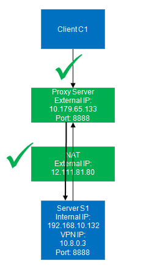

# Enabling Client to reach the Server behind a NAT

## Problem description:
When the server, S1, lives behind a NAT, the client, C1, cannot reach it, because
-	C1 cannot use the External IP address: when S1 intends to reach the world outside the NAT, the NAT dynamically translates S1's internal IP address to an external IP address. The external IP address is dynamic, i.e., only valid for the duration of the session, hence not reachable by C1 in the future
-	Internal IP address not reachable by C1: the internal IP address is behind the NAT and hence packets destined to this IP address get blocked by the NAT
	


## Proposed solution
We make use of a proxy server, with a static external IP address, in the middle. Here is how it works:
1.   The server, S1, establishes a VPN connection, as a VPN client, to the VPN server running on the proxy server
2.   The VPN server in the proxy server allocates an IP address to S1 and maintains the mapping between S1 and this IP address (VPN-assigned IP address)
3.   An nginx proxy running on the proxy server that allocates a port on the proxy server node to S1 (nginx-assigned port). The nginx proxy maintains the mapping between (Proxy_Server_IP:Nginx_Assigned_port, S1_VPN_Assigned_IP:S1_Port). It forwards any incoming request from C1 to S1 based on this mapping



## Steps to implement the proposed solution
1. Set up Porxy Server
    - Any node with a public IP address can be used
    - E.g., we created an Ubuntu 16.04 VM on AWS with the public IPv4 address 34.208.50.35    - 
2. Install OpenVPN Server on Proxy Server
    - Run the following script. Make sure you input the public IP address during the setup
        ```
        $ wget https://git.io/vpn -O openvpn-install.sh && bash openvpn-install.sh
        ```
3. Install Nginx Proxy on Proxy Server
    - On Proxy Server run:
        ```
        $ sudo apt-get install nginx
        $ sudo systemctl start nginx
        ```
4. Install OpenVPN Client on S1
    - For Ubuntu run:
        ```
        $ sudo apt-get install openvpn
        ```
    - For Android install Android OpenVPN Connect on Google Play Store
5.  Connect S1 to OpenVPN Server
    - Use the configuration created in Step 2 to connect to the OpenVPN Server
        ```
        $ sudo openvpn --config client.ovpn
        ```
    - E.g., OpenVPN Server alocated IP address 10.8.0.3 to S1
6.  Update nginx proxy to add forwarding rules
    - Edit nginx config under /etc/nginx/sites-enabled/default to add forwarding rules for S1
        ```
        server {
            listen 22345 default_server;
            listen [::]:22345 default_server;
            ...
        location / {
                proxy_pass http://10.8.0.3:22345;
        }
        ```
    -  Restart nginx
        ```
        $ sudo systemctl restart nginx
        ```
